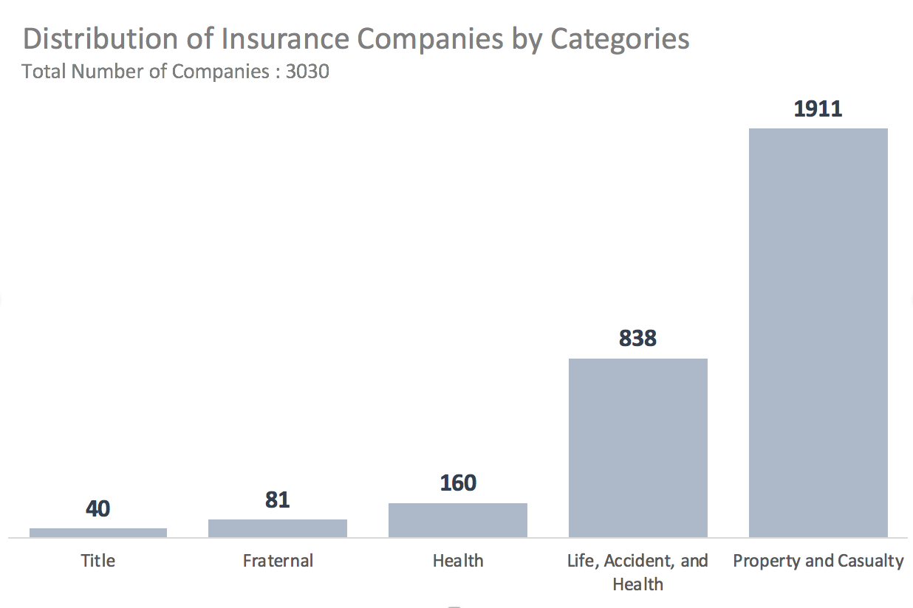

## Project 1 : Simple Web Scraping (National Association of Insurance Commissioners) 

A simple web-scraping analysis on the distribution of all the insurance companies that exist in the database of National Association of Insurance Commissioners (NAIC) by categories.

